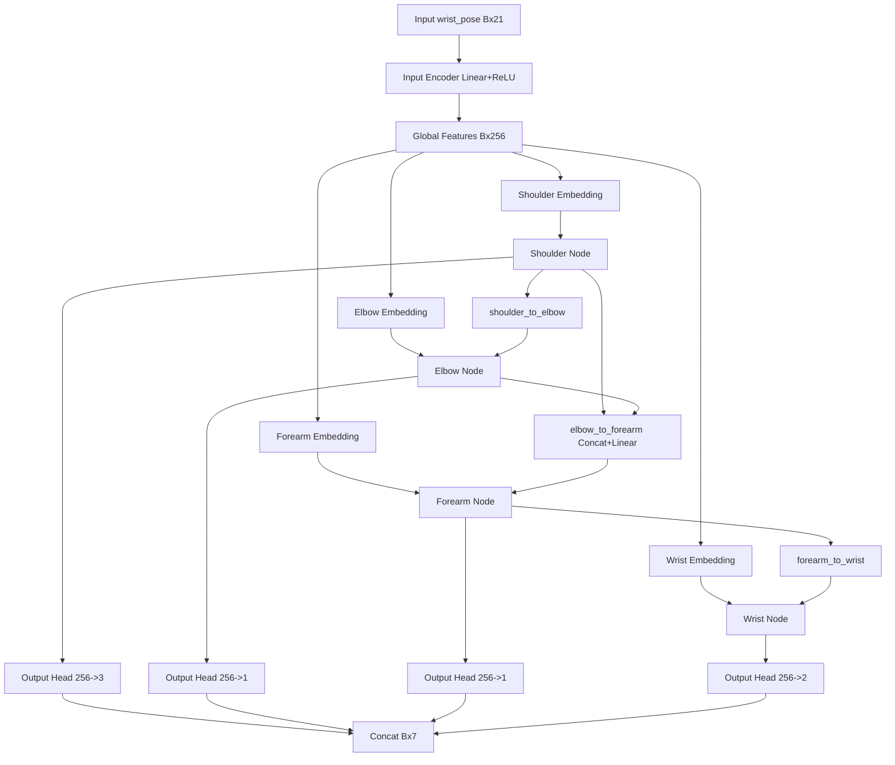
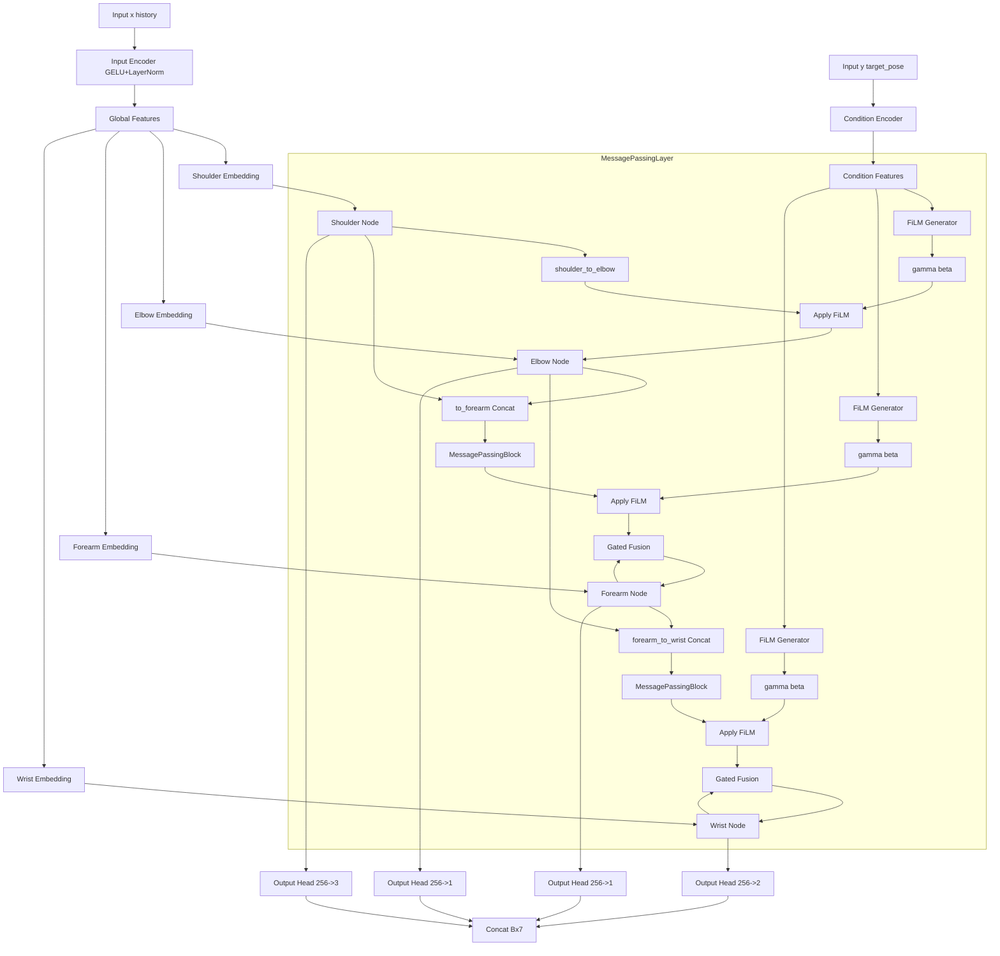
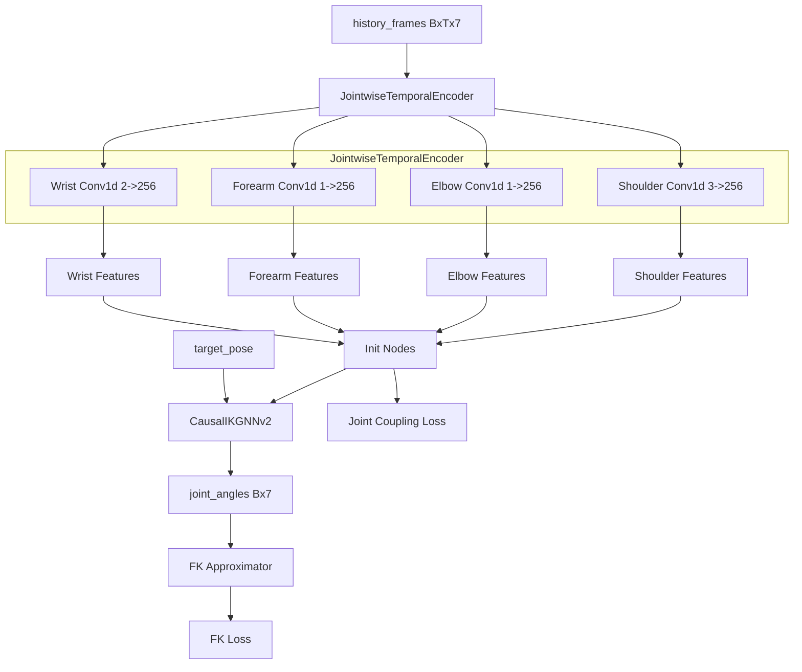
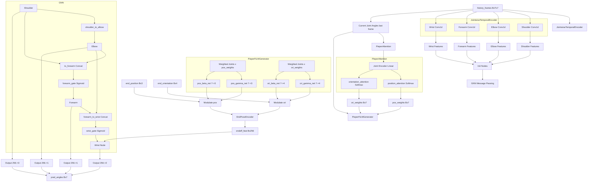
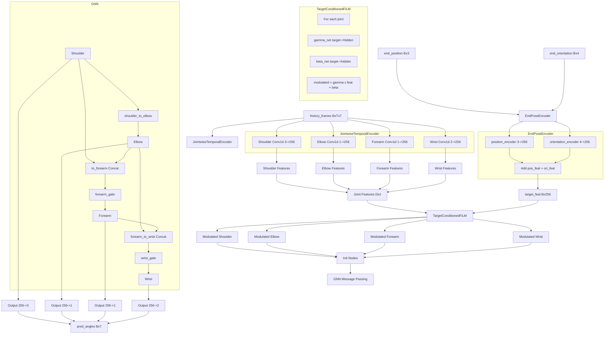
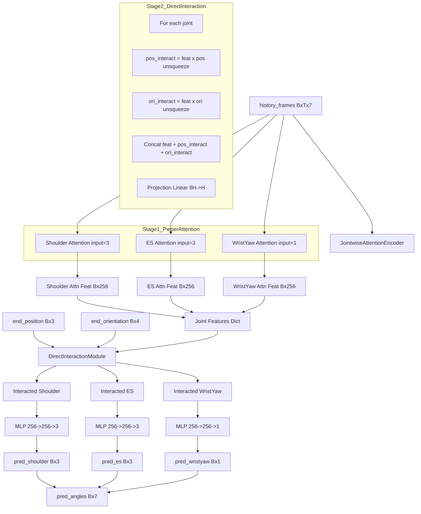
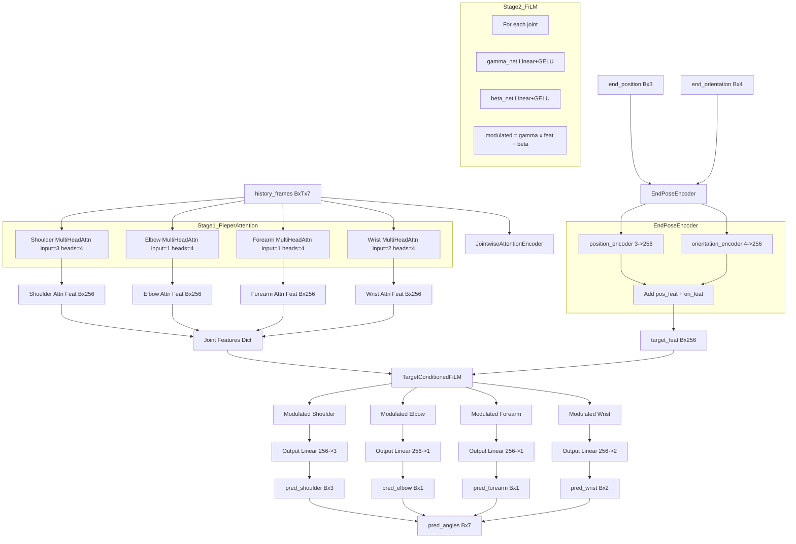

# Pieper 系列模型流程图合集

## 目录
1. [GNN_Film/causal_ik_model_film.py](#1-gnn_film模型)
2. [pieper0902/causal_ik_model_pieper2.py](#2-pieper0902模型)
3. [pieper1002/causal_ik_model_pieper.py](#3-pieper1002模型)
4. [pieper1003/pieper_direct.py](#4-pieper1003-direct模型)
5. [pieper1003/pieper_sefw.py](#5-pieper1003-sefw模型)

---

## 1. GNN_Film 模型

### 1.1 CausalIKGNN (基础GNN因果IK)

### 1.2 CausalIKGNNv2 (改进版+FiLM)

### 1.3 PhysicsAwareCausalIKWithHistory (物理感知+历史)

---

## 2. pieper0902 模型 (PieperCausalIK)

**核心特点**: 使用当前关节角度计算Pieper权重，FiLM调制末端位姿

---

## 3. pieper1002 模型 (PieperCausalIK 修正版)

**核心修正**: FiLM调制改为从目标位姿生成参数，调制历史关节特征

---

## 4. pieper1003/pieper_direct.py (直接相乘版)

**核心特点**: 两阶段架构，直接相乘交互（而非FiLM）

**数据维度说明**:
- `pos_interact`: [Bx256x3] -> [Bx768]
- `ori_interact`: [Bx256x4] -> [Bx1024]
- `combined`: [Bx256 + 768 + 1024] = [Bx2048] for shoulder/es

---

## 5. pieper1003/pieper_sefw.py (注意力+FiLM两阶段，无GNN)

**核心特点**: 两阶段架构，移除GNN，直接从FiLM调制特征预测

---

## 模型对比总结

| 模型 | 历史编码 | 目标交互方式 | GNN | 特点 |
|------|----------|--------------|-----|------|
| CausalIKGNN | 无 | 无 | 有 | 基础GNN因果链 |
| CausalIKGNNv2 | 无 | FiLM调制消息 | 有 | FiLM调制消息传递 |
| PhysicsAwareCausalIKWithHistory | Conv1d关节级 | FiLM | 有 | 物理约束+历史 |
| pieper0902 | Conv1d关节级 | Pieper权重+FiLM | 有 | 从当前关节生成FiLM |
| pieper1002 | Conv1d关节级 | FiLM调制特征 | 有 | **修正版**:目标生成FiLM |
| pieper_direct | MultiHeadAttn | 直接相乘 | 无 | 直接交互，无GNN |
| pieper_sefw | MultiHeadAttn | FiLM调制特征 | 无 | 两阶段，无GNN |
| pieper1101 | Conv1d关节级 | Pieper权重+FiLM | 有 | 时序注意力+多特征融合 |

### FiLM公式对比

| 模型 | FiLM公式 | 说明 |
|------|----------|------|
| pieper0902 | `modulated_pose = gamma * end_pose + beta` | 调制末端位姿 |
| pieper1002/pieper_sefw | `modulated_feat = gamma * history_feat + beta` | 调制历史特征 |
| CausalIKGNNv2 | `modulated_msg = gamma * msg + beta` | 调制消息 |

### 历史编码对比

| 模型 | 编码方式 | 说明 |
|------|----------|------|
| Conv1d版本 | Conv1d时序编码 | 轻量、快速 |
| Attention版本 | MultiHeadAttn | 捕捉长程依赖 |
