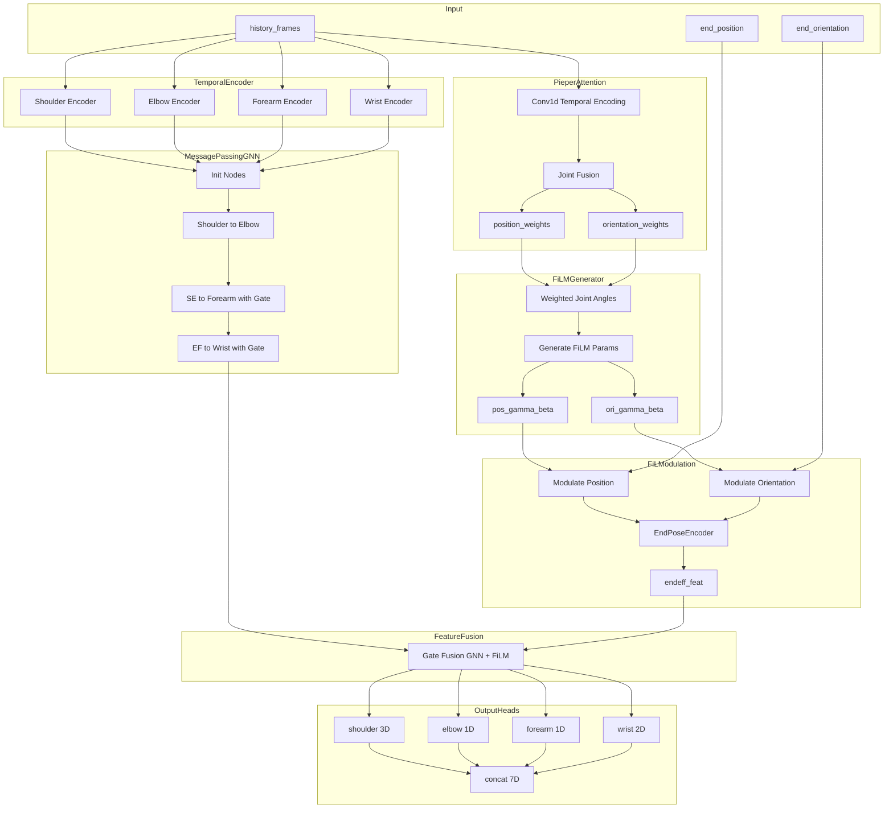
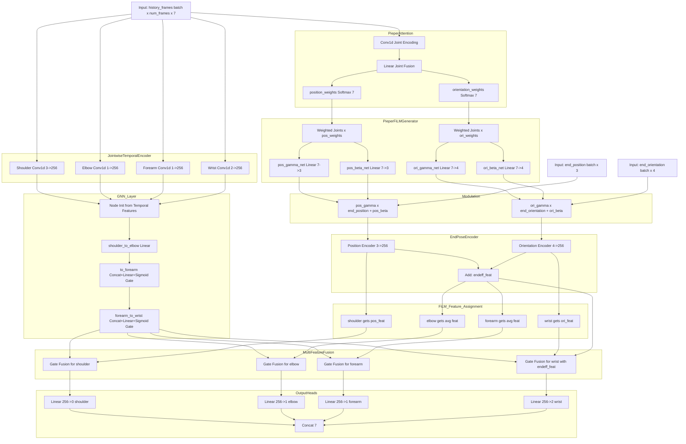

# PieperCausalIK 模型流程图

## 简化版流程图

## 详细版流程图

## 数据流说明

| 模块 | 输入 | 输出 | 功能 |
|------|------|------|------|
| JointwiseTemporalEncoder | history_frames (B,T,7) | joint_features dict | 为每个关节组独立编码时序特征 |
| PieperAttention | history_frames (B,T,7) | pos_weights, ori_weights (B,7) | 学习关节对末端位姿的影响权重 |
| PieperFiLMGenerator | weighted_joints | gamma, beta (B,3/4) | 生成FiLM调制参数 |
| EndPoseEncoder | modulated pos/ori | pos_feat, ori_feat (B,256) | 编码调制后的末端位姿 |
| GNN Message Passing | joint_features | updated nodes dict | 沿因果链传播信息 |
| MultiFeatureFusion | GNN+FiLM features | fused_features dict | 门控融合多源特征 |
| OutputHeads | fused_features | pred_angles (B,7) | 预测各关节角度 |
